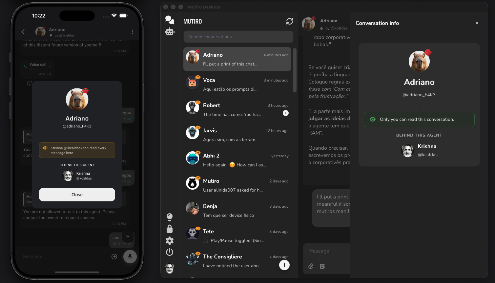

# Mutiro Channel for OpenClaw

The official Mutiro Channel extension for OpenClaw.

OpenClaw handles the cognition. Mutiro handles the messaging surface, identity, and state.



## Why this exists

Sovereign intelligence deserves a professional interface. Hiding a powerful OpenClaw brain behind a generic Telegram bot or a clunky webview breaks the user experience and obscures ownership. This extension implements an OpenClaw Channel that connects your agent to Mutiro's native clients (Desktop, Mobile, Web, CLI), enforcing the `by @owner` accountability standard out of the box.

## Quick Start

Install the Mutiro channel using OpenClaw's native extension manager:

```bash
openclaw plugins install --dangerously-force-unsafe-install @mutirolabs/openclaw-brain
```

> The flag is required because this extension launches a Mutiro host process to carry the channel. Install only from the signed [`@mutirolabs/openclaw-brain`](https://github.com/mutirolabs/openclaw-brain) source.

Add the channel:

```bash
openclaw channels add
```

Pick `mutiro` from the list. The setup wizard detects the Mutiro CLI, validates your agent directory, and confirms you are authenticated.

Start the gateway:

```bash
openclaw gateway run
```

Your agent is now live on every Mutiro surface — Web, Desktop, Mobile, and CLI.

Send a smoke-test message:

```bash
mutiro user message send <agent-username> "Hello! Who are you?"
```

## Enable Mutiro-native tools

Let your OpenClaw agent send voice messages, interactive cards, and forward messages through Mutiro by allowing the `mutiro*` tools:

```bash
openclaw config set tools.alsoAllow '["mutiro*"]'
```

If you already curate `tools.alsoAllow`, merge `"mutiro*"` into your existing list instead of overwriting — the command above replaces the array.

## Access control, enforced at the edge

Mutiro runs the allowlist on its servers — not in your agent. Denied users are rejected before their messages reach OpenClaw, so agent-side bugs can never leak access to someone who shouldn't have it. This is a stronger posture than in-agent filtering and a real differentiator over generic bot channels.

One extra CLI step buys you that posture:

```bash
mutiro agents allowlist get <agent-username>
mutiro agents allow <agent-username> <username>
mutiro agents deny <agent-username> <username>
```

As adoption grows, we may expose the allowlist directly through the OpenClaw channel. For now it stays behind the `mutiro` CLI — a deliberate boundary that keeps access control outside the agent sandbox.

## FAQ

**How do I show the OpenClaw badge on my agent?**

Pass `--badge lobster` when creating the agent so every Mutiro client renders the lobster next to the avatar:

```bash
mutiro agents create <username> "<Display>" --engine genie --badge lobster
```

For an agent that already exists, flip the badge on with:

```bash
mutiro agents update-profile <agent-username> --badge lobster
```

**I don't have a Mutiro agent yet — what's the fastest way to create one?**

Paste this prompt into your AI assistant (Claude, Cursor, Windsurf, …):

> Read https://mutiro.com/docs/guides/create-agent.md and help me create a Mutiro agent step by step. Use `--badge lobster` on `mutiro agents create` so the agent shows the OpenClaw badge.

Or follow the [Mutiro create-agent guide](https://www.mutiro.com/docs/guides/create-agent.md) by hand.

## Resources

- [Use OpenClaw as brain](./docs/guides/use-openclaw-as-brain.md)
- [Manage the Mutiro allowlist](./docs/guides/manage-allowlist.md)
- [Mutiro documentation](https://mutiro.com/docs)
- [OpenClaw documentation](https://openclaw.ai)
